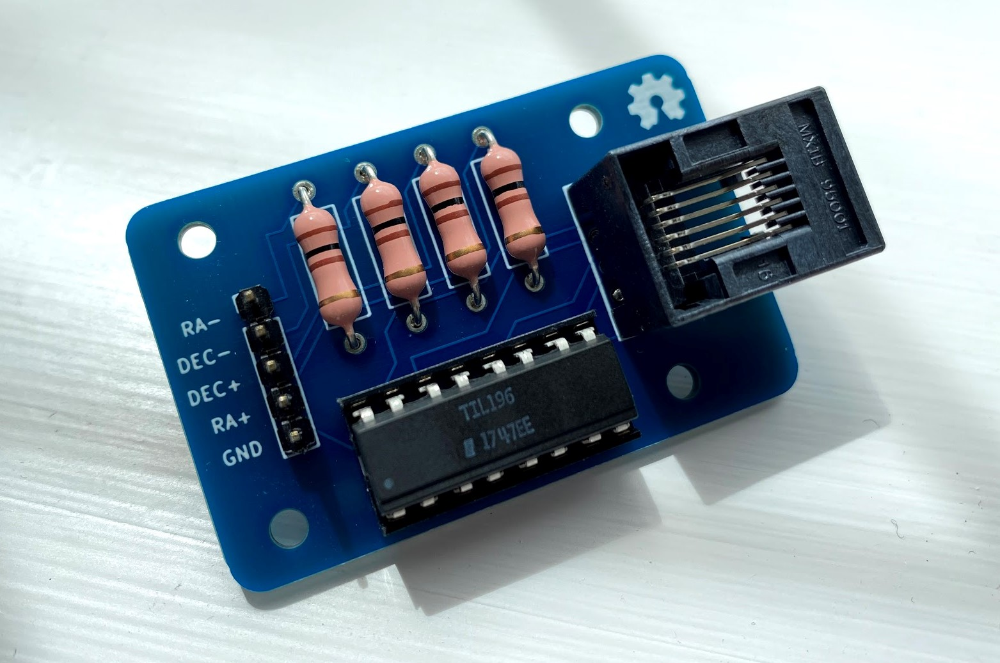
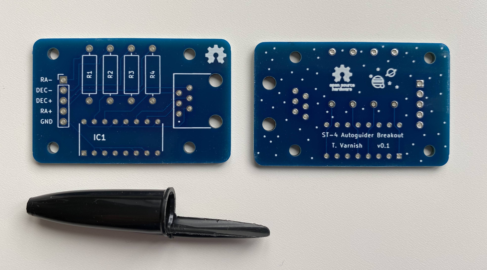
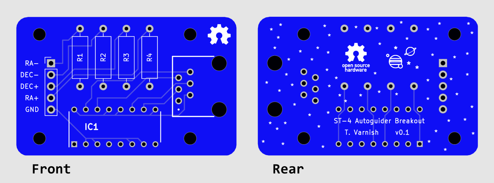

# ST-4 Autoguider Breakout board 
An open-source, versatile breakout board for controlling ST-4 autoguider ports on telescope mounts. Connect the board to the drive motors with an ST-4 cable (RJ12) and use a 5V microcontroller (e.g. Raspberry Pi GPIO or Arduino) to easily control the motor axes!

> :warning: **IMPORTANT:** I've only tested this with a **Skywatcher Enhanced Dual-Axis Motor Drive for EQ3-2 Mount**, so I can't guarantee it'll work with every autoguider-compatible telescope mount! If you've tried this on another 'scope, let me know if it was successful!

    

To trigger an axis, pull the corresponding input header pin HIGH (5V). This breakout board can be used for dual-axis control at a single slewing speed (set by the motor drive handset).

> :warning: **ANOTHER IMPORTANT NOTE:** Only trigger a single axis (HIGH) at a time. There isn't anything (yet) in the hardware that will prevent this, so make sure it doesn't ever happen through software.

I had the v0.1 board printed with [JLCPCB](https://jlcpcb.com/), as seen in the image above.

All of the KiCAD files (and gerbers) for the breakout can be found in the `/ST4Breakout` directory.

## Required Components
To construct the board, along with the PCB you'll also need the following components:

Component | Quantity
----------|---------
[RJ12 Socket](https://uk.rs-online.com/web/p/products/2400929/) | 1
[100 Ohm Resistor](https://uk.rs-online.com/web/p/products/7078625/) | 4
[TIL196 Phototransistor Optocoupler](https://uk.rs-online.com/web/p/products/1611233/) | 1
[16-pin IC DIP Socket](https://uk.rs-online.com/web/p/products/0402771/) | 1
[Single-row 2.54 mm Header Pins](https://uk.rs-online.com/web/p/products/2518632/) | 5 pins

*(All links provided are for RS Components UK)*
Component footprints and 3D models are provided for these specified components. Equivalent parts may work, but their footprints may be slightly different, so I can't guarantee they'll fit the PCB.

## Additional Board Images

    

Front and back of the board (unpopulated). Ballpoint pen lid for scale. I thought a banana would be a bit too big. And... I didn't have one to hand.

    

Gerber renders for the front and back of the PCB.

## Circuit Description
I've provided a basic explanation for the operation of the breakout board below, in case it helps you to decide if the board will work for your mount (if it isn't a Skywatcher EQ3-2). **Note: I can't guarantee if this will work for your mount/drive! Use at your own risk!**

Each axis has a positive and negative trigger pin. Applying a 5V signal to one of these pins will "trigger" the telescope axis to move in that specific direction.

Each trigger pin is connected (via a current limiting resistor) to the input of a quad-input optocoupler (TIL196). This connects the microcontroller circuit to the telescope motor drive circuit, isolating each side. Triggering an axis will connect the corresponding wire in the ST-4 pin to ground, completing the controller circuit. The optocoupler IC is required to ensure that the voltage/current on the motor controller side doesn't break the microcontroller.

    

## Author
Created by Thomas Varnish. Find me [@tvarnish](https://github.com/tvarnish) on GitHub and [@ThomasVarnish](https://twitter.com/ThomasVarnish) on Twitter :smiley: